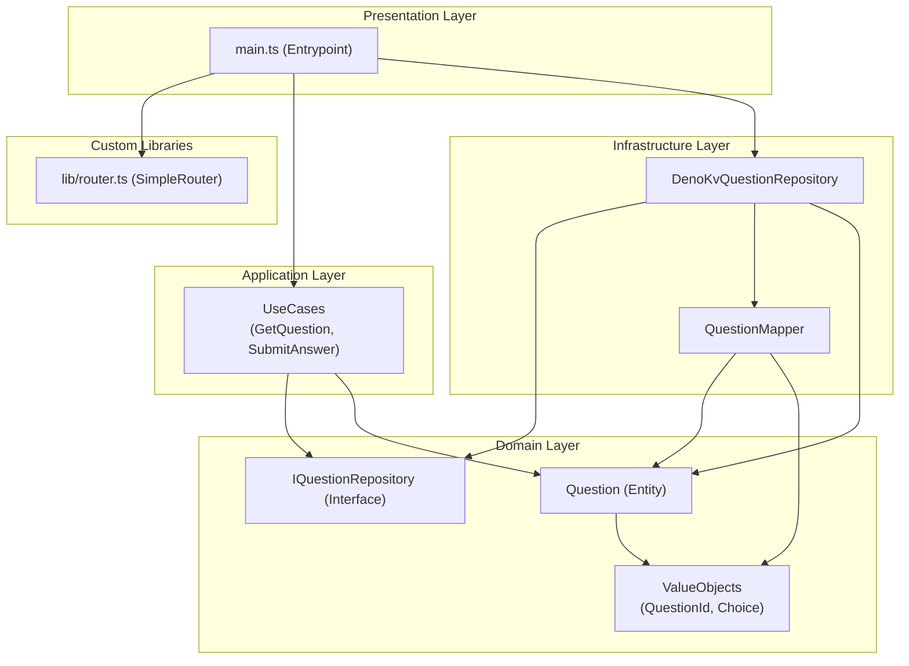

# Dependency Diagram

This document illustrates the dependency graph of the major components in this
project. The arrows indicate the direction of dependency (e.g., A --> B means A
depends on B).

### Diagram Explanation

- **Presentation Layer (`main.ts`)**: The application's entry point. It
  assembles the router, use cases, and the concrete repository
  (`DenoKvQuestionRepository`) to build the application.
- **Application Layer (`UseCases`)**: Depends on the Domain layer's interfaces
  (`IQuestionRepository`) and entities, remaining isolated from specific
  infrastructure implementations.
- **Infrastructure Layer**: Implements the Domain layer's interfaces and handles
  the concrete persistence logic (accessing Deno KV and mapping data).
- **Domain Layer**: The core of the project. It contains pure business logic and
  rules, with no dependencies on any other layer.
